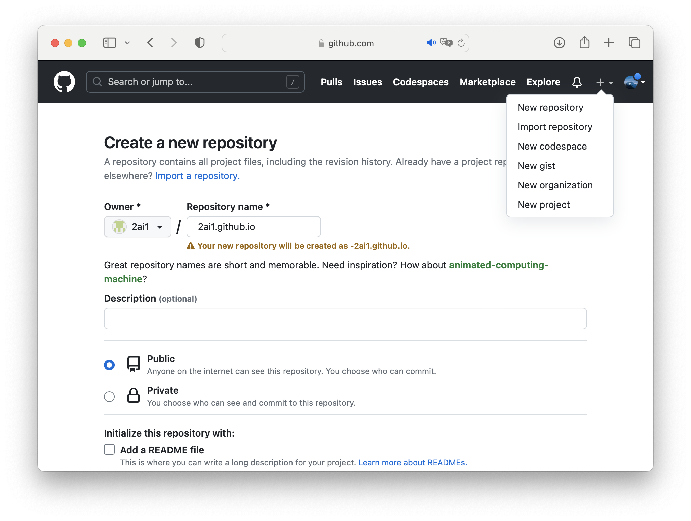
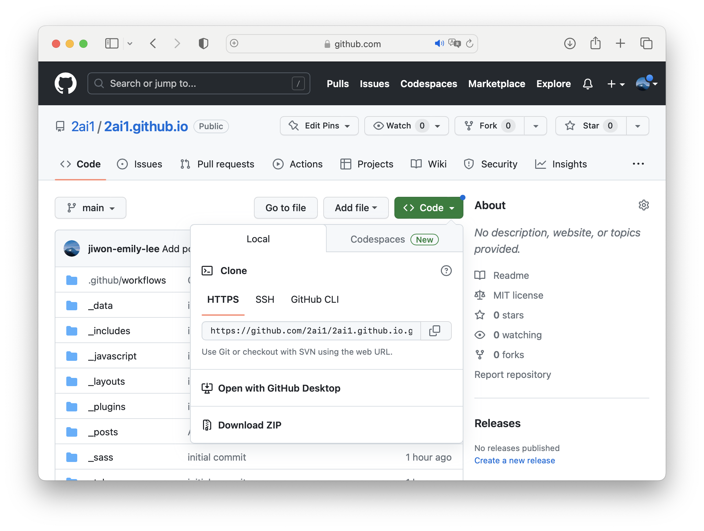
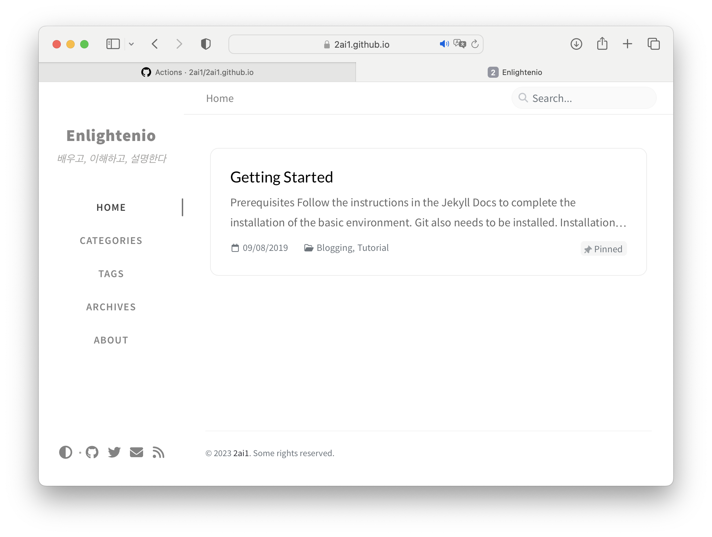

깃허브 블로그 생성 기록

## 0. 깃허브 Repository 생성

{: width="972" height="589" }
_`+ New Repository`로 블로그를 만들어 줄 repository를 추가한다_  

>  깃허브 블로그를 생성하기 위해서는 Repository name을 `{user name}/{organization name}.github.io`로 설정해야 한다.
{: .prompt-tip }


## 1. 로컬 저장소 연결
{: width="972" height="589" }
_HTTPS의 URL을 복사한다_

터미널에서 로컬 저장소 파일을 만들고 싶은 경로로 이동한다.
```bash
$ cd desktop
```

아까 복사한 주소를 붙여넣어 clone한다.
```bash
$ git clone https://github.com/{username}/{username}.github.io.git
```

## 2-1. Jekyll 이용하기
로컬 저장소가 있는 경로에서 Jekyll 설치하기
```bash
$ gem install jekyll bundler
```
```bash
$ jekyll new ./
```
로컬 서버 열기
```bash
$ bundle install
```
```bash
$ bundle exec jekyll serve
```

터미널의 안내문에 따라 Server address에 나와있는 주소를 복사해서 주소창에 붙여넣으면 로컬서버에 Jekyll 블로그가 만들어져있음을 확인할 수 있다.

## 2-2. Jekyll 테마 다운

구글링을 통해 원하는 테마를 찾는다. 이 블로그는 chirpy를 사용했다.

https://github.com/cotes2020/jekyll-theme-chirpy 

`<> code`의 `Download Zip`을 통해 전체 파일을 다운한 뒤, `{username}.github.io` 파일에 복사붙여넣기 해준다. (중복 파일은 replace)

## 3. 로컬 서버 실행
위에서 했던 것처럼 로컬 서버를 열어 확인해본다.
```bash
$ bundle install
```
```bash
$ bundle exec jekyll serve
```

## 4. 커스텀
_config.yml의 instruction을 따라 수정해주면 된다.

- title → 블로그 이름
- tagline → 블로그 이름 하단 문장
- url → 블로그 주소
- timezone → Asia/Seoul

css나 footer, favicon, avatar img 등도 원하는 대로 수정해준다. chirpy의 경우, https://github.com/cotes2020/jekyll-theme-chirpy/wiki 을 보면 쉽게 수정할 수 있다.

## 5. 빌드

> 빌드 전에 repository에서 `Settings > Pages > Source` 를 `GitHub Actions`로 바꿔준 뒤, instruction에 따라 commit 해주어야 한다.
{: .prompt-warning }

전부 수정이 되었고, 위 주의 사항을 모두 처리했다면 빌드를 해준다.
```bash
$ git add *
```
```bash
$ git commit -m "커밋 메시지"
```
```bash
$ git push
```

`Actions > pages build and deplyment`가 성공했으면 주소로 들어가본다.
{: width="972" height="589" }
_성공_
